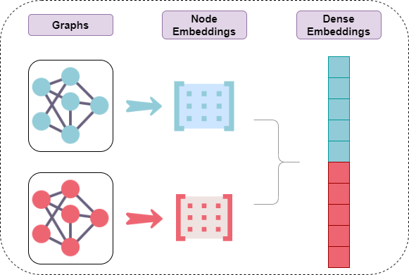

.. Graph-Embeddings documentation master file, created by
   sphinx-quickstart on Sun Jun 26 10:03:54 2022.
   You can adapt this file completely to your liking, but it should at least
   contain the root `toctree` directive.

Welcome to Graph-Embeddings's documentation!
============================================

This project aims to bring graph embeddings methods for downstream tasks.

Installation:
#############

It's advised to install graph-embeddings using a virtual env, inside the env use::

   pip install graph-embeddings

Get Started Example:
####################

Find the Node2Vec presentation for each node in a set of graphs

.. code-block:: python

   import networkx as nx
   from graph_embeddings.algorithms import StackedNode2Vec

   g1 = nx.DiGraph()
   g2 = nx.DiGraph()
   g1.add_edges_from([("A", "B"), ("B", "C"), ("C", "B"), ("B", "E")])
   g2.add_edges_from([("A", "B"), ("B", "D"), ("D", "C"), ("C", "D")])

   graphs = [g1, g2]
   embedding_model = StackedNode2Vec()
   embedding_model.fit(graphs)

   embedding_model.get_embeddings()  # ndarray with shape (2, 5, 128) - graphs, nodes, embedding_size
   embedding_model.get_dense_embeddings()  # ndarray with shape (2, 640) - graphs, nodes*embedding_size

.. toctree::
   :maxdepth: 2
   :titlesonly:
   :caption: User Guide / Tutorials:

   tutorials/StackedNode2Vec

.. toctree::
   :maxdepth: 2
   :caption: API Reference:

   api/StackedNode2Vec

.. toctree::
   :maxdepth: 2
   :caption: Release Notes

   release_notes

Indices and tables
==================

* :ref:`genindex`
* :ref:`modindex`
* :ref:`search`
